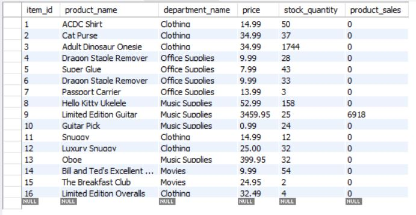
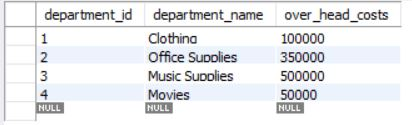

# BAMAZON

## WHAT IS IT?

This is a database app that allows the user to manipulate a MySQL database with three different node.js programs. The inquirer node package is used to allow the user to manipulate the data.

## THE NODE.JS PROGRAMS

### ***bamazonCustomer.js***

This program allows you to: 
 - see what is for sale
 - select what you want to buy

An items total purchases are saved in the database to be used later.

### ***bamazonManager.js***

This allows a manager to:
 - view what is for sale
 - view what items are running low on supply (less than 10 in stock)
 - add more stock to a selected item
 - add a new product for sale. The departments that can be selected are based on what the Supervisor has created

 

### ***bamazonSupervisor.js***

The supervisor has the option to:
 - see what departments are available and what their sales are
 - add a new department that the manager can then add products to

 

## MySQL TABLES

There are two tables used in this program (as shown below). The node.js programs above manipulate these tables to create the functionality needed for each application.

### ***Products Table***

The table that contains all information about each product. The customer can purchase items from this list. The purchase reduces inventory and adds the transaction to product_sales (in total dollars)

The manager can add inventory and insert new items to this table.

### ***Departments Table***

The supervisor can insert new departments to this table. The supervisor can also view the total sales and total profit for each department using this table in conjunction with the products table

A manager can only add departments listed in this table when adding new products to the products table.

## TECHNOLOGIES APPLIED

- MySQL database
- node.js
    NPM Packages
    - mysql
    - inquirer
    - cli-table